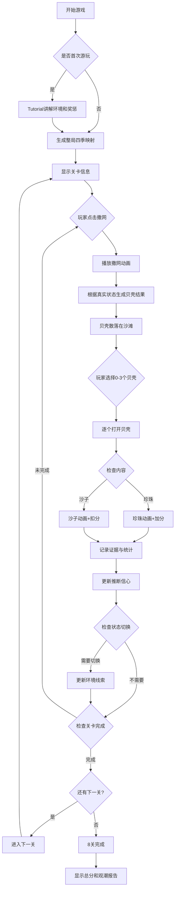

# 《捡贝壳儿》手机网页游戏 — 需求文档

## 一、游戏概述

**游戏名称：** 捡贝壳儿  
**平台：** 手机浏览器（移动端优先，响应式适配）  
**类型：** 休闲益智 / 状态推断 / 认知灵活性训练  
**设计启发：** 受到关于 OCD、血清素与 belief stickiness（信念黏性）的最新研究启发。游戏将研究中的“环境状态变化后，玩家是否仍坚持旧判断”转译为轻量、非医疗化的休闲玩法。  
**定位说明：** 本游戏是认知科学启发的娱乐产品，不用于诊断、治疗或评估 OCD 等精神健康状况。

**核心玩法：** 玩家用渔网从海边捞起贝壳，每轮从捞起的贝壳中挑选最多3个打开。贝壳里可能藏有珍珠（加分）或沙子（扣分）。真正的挑战不是单纯记住某个贝壳，而是判断“当前海边季节/海况是否已经悄悄变化”，并在新证据出现时及时放下旧判断。

**核心体验一句话：** 在一个悄悄变化的海边世界里，玩家要根据贝壳结果和环境线索更新判断，避免被上一季的成功经验黏住。

---

## 二、核心机制

### 2.1 模式设计

游戏包含两个模式，方便兼顾普通玩家和研究启发玩法：

| 模式 | 目标用户 | 季节提示 | 玩法重点 |
|------|----------|----------|----------|
| 休闲模式 | 第一次游玩、低压力玩家 | 明确显示当前季节 | 认识贝壳、理解珍珠/沙子、积累基础记忆 |
| 观潮模式 | 核心玩法、挑战玩家 | 不直接显示季节，只给环境线索 | 根据反馈推断当前状态，训练信念更新 |

**默认流程建议：**
- 玩家首次进入必须完成新手引导。
- 新手引导后进入第1关。
- 第1-2关使用休闲模式规则，帮助玩家建立基础理解。
- 第3关开始解锁观潮模式。
- 结算时分别记录休闲模式最高分和观潮模式统计。

### 2.2 新手引导

新手引导是正式游戏前的短流程，目标不是考验玩家，而是让玩家理解“看环境、开贝壳、根据反馈更新判断”的基本循环。

**引导时长：** 2-3分钟。  
**是否计分：** 不计入正式成绩和统计报告。  
**贝壳数量：** 只出现4种基础贝壳，其中包含2种稳定贝、1种反转贝、1种线索贝。  
**季节数量：** 只展示2种海况，例如春潮和夏潮，避免信息过载。

**引导步骤：**
1. **观察环境：** 画面突出天空颜色、浪花速度、背景元素和音效变化，提示玩家“海边环境会影响贝壳内容”。
2. **第一次撒网：** 玩家打开2个贝壳，看到珍珠加分、沙子扣分。
3. **讲解奖励惩罚：** 珍珠加分，沙子扣分；如果这一轮都不想打开，可以直接点“撒网”跳过。
4. **展示同季稳定性：** 同一海况下，同一种贝壳的结果保持一致。
5. **暗中切换海况：** 背景和音效发生变化，但不立刻给答案。
6. **打开反转贝：** 玩家看到上一轮有效的贝壳现在可能变差。
7. **引导更新判断：** 用一句轻提示说明“海况可能变了，可以根据新结果调整选择”。
8. **进入第1关：** 玩家确认后开始正式关卡。

**引导文案风格：**
- 使用轻量、游戏内语气，例如“海风变凉了，贝壳里的东西也可能不一样”。
- 避免使用“信念黏性”“认知测试”等术语。
- 不使用医疗化反馈。

### 2.3 季节/海况系统

游戏中有4个隐藏状态，对应4个季节，也可以理解为4种海况规则：

| 状态 | 背景主色调 | 环境线索 | 音效线索 |
|------|------------|----------|----------|
| 春潮 | 明亮绿色 + 粉色 | 绿色天空光、樱花、柔和阳光、浅色浪线 | 轻风、清亮水声 |
| 夏潮 | 高饱和蓝色 + 金色 | 蓝色天空、强光、活跃浪花、海面高亮 | 明亮浪声、远处海鸟 |
| 秋潮 | 金黄色 + 橙色 | 黄色天空、落叶、夕阳、沙滩偏暖 | 低缓风声 |
| 冬潮 | 白色 + 冷蓝 | 白色天空、雪花、冷光、海面偏静 | 空旷风声、低频水声 |

**状态切换规则：**
- 每局开始时生成4套固定的“季节-贝壳内容映射”，整局内保持不变。
- 状态会按关卡配置在若干轮后切换。
- 休闲模式：切换时明确显示“春潮来了”等提示。
- 观潮模式：切换时不显示状态名称，只通过背景、音效、浪花和光线变化暗示。
- 同一状态内，同一种贝壳的内容保持一致。
- 状态再次回到同一季节时，映射仍然沿用该季节原表，不重新随机。

**关键设计原则：**
- 玩家应该能通过反馈学习规律，而不是被纯随机惩罚。
- 状态切换后，玩家会短暂经历“旧规则是否还可靠”的判断过程。
- 高关卡挑战的是“更新速度”，不是盲猜运气。

### 2.4 贝壳系统

完整贝壳库共20种，每种有独特外观。但正式游玩不会一开始全部出现，而是按关卡逐步扩充“当前可出现贝壳池”，降低初期记忆压力。

| 类别 | 特征 | 示例 |
|------|------|------|
| 圆形贝 | 浑圆、光滑 | 白珍珠贝、粉红贝、金黄贝、彩虹贝、夜光贝 |
| 长形贝 | 细长、有棱 | 尖塔螺、笔螺、笋螺、锥螺、管螺 |
| 扇形贝 | 扇状展开 | 大扇贝、小扇贝、火焰扇贝、海菊蛤、日月贝 |
| 奇异贝 | 造型独特 | 鹦鹉螺、唐冠螺、法螺、蜘蛛螺、维纳斯梳 |

**外观特征：**
- 每种贝壳有3种状态：未开、打开中、已开。
- 外观差异包括：形状、颜色、纹理、大小。
- 外观在所有季节保持不变，方便玩家建立“贝壳身份”。

**贝壳池解锁原则：**
- 新手引导只出现4种贝壳。
- 第1-2关出现6种贝壳。
- 第3-4关出现8-10种贝壳。
- 第5-6关出现12-14种贝壳。
- 第7关出现16种贝壳。
- 第8关或最终测试可使用20种完整贝壳库。

### 2.5 贝壳功能类型

为了让“信念更新”更明显，20种贝壳不只是随机分布，还应包含不同认知功能：

| 类型 | 数量建议 | 设计目的 | 示例 |
|------|----------|----------|------|
| 稳定贝 | 6种 | 多数季节结果相同，帮助玩家建立基础安全感 | 3季珍珠、1季沙子 |
| 反转贝 | 6种 | 在相邻季节结果相反，用于制造旧规则诱饵 | 春珍珠、夏沙子 |
| 线索贝 | 4种 | 对某个季节具有强提示作用 | 只在冬潮稳定出珍珠 |
| 干扰贝 | 4种 | 结果分布较均衡，避免策略过于机械 | 2季珍珠、2季沙子 |

**旧规则诱饵：**
- 若某贝壳在上一状态中多次给出珍珠，状态切换后它可能变成沙子。
- 玩家如果持续选择该贝壳，统计系统会记录为“旧规则坚持”。
- 诱饵不能过多，避免玩家觉得游戏恶意。

### 2.6 季节-贝壳内容映射

**规则：**
- 每个季节从当前可出现贝壳池中选择约40%-60%的贝壳藏有珍珠，其余藏沙子。
- 每局开始一次性生成4个季节的映射表。
- 整局内映射不再刷新。
- 每个季节至少包含2种线索贝和2种反转贝，保证状态推断有足够证据。
- 随关卡扩充贝壳池时，新贝壳加入映射；已出现贝壳的既有映射不改变。

**映射数据结构（伪代码）：**

```javascript
const seasonMappings = {
  spring: { shell_01: "pearl", shell_02: "sand", shell_03: "pearl" },
  summer: { shell_01: "sand", shell_02: "pearl", shell_03: "sand" },
  autumn: { shell_01: "pearl", shell_02: "pearl", shell_03: "sand" },
  winter: { shell_01: "sand", shell_02: "sand", shell_03: "pearl" }
};
```

### 2.7 捞取与选择机制

**捞取阶段：**
1. 玩家点击“撒网”按钮。
2. 渔网动画从岸边撒入海中。
3. 等待1-2秒。
4. 渔网收回，展示捞起的贝壳，数量由当前关卡决定。
5. 贝壳从渔网中散落在沙滩上。

**选择阶段：**
1. 玩家从捞起的贝壳中挑选最多3个。
2. 点击贝壳即选中，再次点击取消选中。
3. 每轮正式游戏固定捞起3个贝壳，玩家可以选择1-3个。
4. 选择后可以点击“打开”查看结果。
5. 如果这一轮3个贝壳都不想打开，玩家可以不选择贝壳，直接点击“撒网”跳过当前轮。
6. 跳过不加分、不扣分、不揭示内容，但会推进到下一轮，并记录为保守/放弃行为。

**推断反馈：**
- 每次开贝壳后显示结果：珍珠/沙子、得分变化。
- 观潮模式中不直接告诉玩家真实季节，但可以显示“海况似乎变了”“这个结果和刚才不太一样”等非答案型提示。
- 结算页显示玩家的更新速度、旧规则黏性和探索策略。

---

## 三、关卡设计

### 3.1 关卡总览

共8关，每关固定轮次，难度递增：

| 阶段 | 关卡 | 网型 | 可出现贝壳池 | 捞起贝壳数 | 每轮可选 | 固定轮次 | 状态变化频率 | 提示强度 |
|------|------|------|----------------|------------|----------|----------|--------------|----------|
| 引导 | Tutorial | 练习网 | 4种 | 1-2 | 1-2 | 4轮 | 固定脚本 | 强提示 |
| 入门 | 第1关 | 小破网 | 6种 | 3 | 3 | 5轮 | 每5轮 | 明确提示 |
| 入门 | 第2关 | 补过的网 | 6种 | 3 | 3 | 8轮 | 每4轮 | 明确提示 |
| 学习 | 第3关 | 普通渔网 | 8种 | 3 | 3 | 8轮 | 每4轮 | 弱提示 |
| 学习 | 第4关 | 结实渔网 | 10种 | 3 | 3 | 10轮 | 每3轮 | 环境线索明显 |
| 进阶 | 第5关 | 大号渔网 | 12种 | 3 | 3 | 12轮 | 每3轮 | 环境线索中等 |
| 进阶 | 第6关 | 专业渔网 | 14种 | 3 | 3 | 12轮 | 每2轮 | 环境线索中等 |
| 挑战 | 第7关 | 黄金渔网 | 16种 | 3 | 3 | 14轮 | 每2轮 | 环境线索较弱 |
| 测试 | 第8关 | 传说渔网 | 20种 | 3 | 3 | 16轮 | 每1轮 | 仅细节线索 |

**说明：**
- “固定轮次”：每关必须完成指定轮次才能进入下一关。
- “状态变化频率”：每N轮后切换到另一个季节/海况。
- Tutorial不计入正式成绩，只负责讲解操作、奖励惩罚和环境观察。
- 第1-2关主要巩固机制，贝壳池控制在6种，但每轮仍提供3个贝壳供玩家选择。
- 第3关起开始引导玩家观察状态变化。
- 第8关作为最终测试，使用20种完整贝壳库，每轮都可能换状态，但映射仍沿用整局固定表。

### 3.2 单次测试长度

为了支持固定时间点重复测试，每局正式测试应保持短而稳定。

| 项目 | 建议 |
|------|------|
| Tutorial | 2-3分钟，仅首次或玩家主动重玩 |
| 正式测试 | 8-10分钟 |
| 单次完整流程 | 10-12分钟 |
| 最长不超过 | 15分钟 |
| 正式轮数 | 约85轮以内 |
| 隐藏状态切换 | 至少12次 |

**设计理由：**
- 时间太短，状态切换次数不足，黏性指数和适应轮数不稳定。
- 时间太长，疲劳、烦躁和练习效应会影响结果。
- 重复测试时应使用同等长度、同等关卡配置和相近环境。

### 3.3 网型升级

每关对应一种渔网，有独特的外观和撒网动画：

| 等级 | 名称 | 外观描述 | 撒网动画特点 |
|------|------|----------|--------------|
| 1 | 小破网 | 破旧、有洞 | 笨拙地扔出，网在空中歪斜 |
| 2 | 补过的网 | 有补丁痕迹 | 稍有章法，但仍有抖动 |
| 3 | 普通渔网 | 标准蓝色渔网 | 正常撒网动作 |
| 4 | 结实渔网 | 厚实、颜色深 | 有力地撒出，网面展开大 |
| 5 | 大号渔网 | 体积更大 | 大幅度撒网，覆盖面积广 |
| 6 | 专业渔网 | 带金属配件 | 专业动作，网面展开漂亮 |
| 7 | 黄金渔网 | 金色丝线 | 闪光特效，撒网带金色尾迹 |
| 8 | 传说渔网 | 彩虹流光 | 彩虹尾迹，撒网时有星星特效 |

---

## 四、得分与判定

### 4.1 得分规则

| 结果 | 得分 | 特效 |
|------|------|------|
| 开出珍珠 | +10分 × 关卡倍率 | 金光闪烁 + 珍珠飞入收藏栏 |
| 开出沙子 | -8分 × 关卡倍率 | 贝壳裂开 + 沙子流出动画 |
| 跳过当前轮 | 0分 | 贝壳淡出，不揭示内容 |
| 连续适应奖励 | +5分 × 关卡倍率 | 连续命中新状态中的珍珠时触发 |

**关卡倍率：** 第N关倍率为N。  
**扣分调整：** 沙子从 -5 调整为 -8，减少随机乱选的收益。  
**跳过策略：** 玩家可以直接点击“撒网”跳过当前轮，避免在不确定时被迫打开。  

### 4.2 认知表现奖励

| 行为 | 奖励/反馈 | 目的 |
|------|-----------|------|
| 状态切换后2轮内命中率恢复 | 更新奖励 | 鼓励快速吸收新证据 |
| 放弃上一状态高收益但当前疑似变差的贝壳 | 灵活奖励 | 鼓励放下旧判断 |
| 选择线索贝验证状态 | 探索奖励 | 鼓励主动获取信息 |
| 连续选择已多次出沙子的旧贝壳 | 无额外惩罚，但记录黏性 | 避免羞辱玩家，只做反馈 |

### 4.3 胜负条件

**通关条件：** 完成当前关卡的所有固定轮次。  
**失败条件：** 无失败机制，分数可以为负。  
**最终目标：** 8关全部完成后，获得尽可能高的总分，同时获得一份“观潮报告”。

### 4.4 结算评价

结算不只按总分，还结合命中率、更新速度、旧规则黏性和探索平衡：

| 称号 | 主要条件 |
|------|----------|
| 敏锐观潮者 | 高分 + 状态切换后更新快 + 旧规则黏性低 |
| 灵活航海家 | 分数中高 + 能较快放弃失效规则 |
| 稳健拾贝人 | 失误少 + 跳过策略合理，但探索偏保守 |
| 勇敢探贝者 | 探索多 + 发现线索快，但扣分也较多 |
| 执着收藏家 | 反复选择旧珍珠贝，旧规则黏性高 |

---

## 五、UI/UX 设计

### 5.1 整体布局（竖屏，375×667基准）

```
┌─────────────────────────────┐
│ 第3关       分数:120        │
│ 海况: 未知   信心: 62%      │  ← 观潮模式中显示推断信息
├─────────────────────────────┤
│                             │
│    [动态海边场景]            │
│    天空、海浪、沙滩、季节线索 │
│    [贝壳散落区]              │
│                             │
├─────────────────────────────┤
│ 本轮: 3/10  已选: 2/3       │
├─────────────────────────────┤
│       [撒网]   [打开]        │
│   最近线索: 金黄贝出沙子      │
└─────────────────────────────┘
```

### 5.2 推断 UI

观潮模式中，UI不直接暴露真实季节，但可以显示玩家可理解的推断辅助：

| UI元素 | 显示内容 | 说明 |
|--------|----------|------|
| 海况罗盘 | 春潮/夏潮/秋潮/冬潮的可能性 | 可选功能，不直接给真值 |
| 信心条 | 0%-100% | 根据玩家最近打开结果估算 |
| 最近线索 | “粉红贝连续2次出沙子” | 帮助玩家复盘证据 |
| 观潮提示 | “海面颜色变冷了” | 环境变化提示，不给答案 |

**注意：**
- UI文字不能过度教学，避免变成说明书。
- 反馈要像游戏内自然观察，而不是医学测评。

### 5.3 交互流程

```
首次开始 → Tutorial → 生成整局四季映射 → 显示第1关 → 点击撒网 → 撒网动画 →
生成当前状态下的贝壳结果 → 玩家选择0-3个 → 打开贝壳 →
显示珍珠/沙子和线索 → 更新分数与统计 → 判断是否状态切换 →
更新环境线索 → 判断关卡完成 → 进入下一轮/下一关 → 第8关最终测试 → 结算观潮报告
```

### 5.4 Tutorial UI

Tutorial 使用可点击、可跳过但默认推荐完成的短流程：

| 步骤 | 屏幕重点 | 玩家动作 | 反馈 |
|------|----------|----------|------|
| 观察海边 | 背景和音效变化 | 点击“我看到了” | 环境线索高亮一次 |
| 第一次撒网 | 1-2个基础贝壳 | 点击撒网 | 贝壳落到沙滩 |
| 打开贝壳 | 珍珠/沙子演示 | 选择并打开 | 显示加分/扣分 |
| 同季重复 | 同一种贝壳再次出现 | 再次打开 | 说明同一海况下结果稳定 |
| 海况变化 | 背景变色、浪声变化 | 观察后继续 | 不直接给答案 |
| 反转演示 | 旧贝壳变成沙子 | 打开反转贝 | 提示“海况可能变了” |
| 进入正式关 | 第1关标题 | 点击开始 | 记录正式测试起点 |

**跳过规则：**
- 首次游玩不建议跳过，但允许玩家在设置中关闭。
- 跳过Tutorial时，第1关前仍显示3条极短提示：看环境、贝壳会变、珍珠加分沙子扣分。

### 5.5 动画规范

**贝壳打开动画：**
- 时长：1秒。
- 过程：
  1. 贝壳轻微抖动（0.2s）。
  2. 贝壳缓缓张开（0.3s）。
  3. 内容物升起（0.3s）。
  4. 光效爆发（0.2s）。
- 珍珠版本：金色光效 + 珍珠旋转上升 + 粒子特效。
- 沙子版本：灰色烟雾 + 沙子流出 + 贝壳裂纹。

**状态切换动画：**
- 休闲模式：旧背景淡出 → 新背景淡入 → 状态名称显示。
- 观潮模式：不显示状态名称，只改变背景色温、浪花速度、音效层次和细节元素。

**撒网动画：**
- 时长：1.5秒。
- 过程：渔网从岸边抛出 → 入水涟漪 → 收网 → 贝壳掉落。

### 5.6 音效设计

| 事件 | 音效描述 | 时长 |
|------|----------|------|
| 撒网 | 水花声 + 网入水声 | 1.5s |
| 贝壳选中 | 清脆“叮”声 | 0.2s |
| 贝壳打开（珍珠） | 悦耳“叮铃”声 + 欢快短音 | 1s |
| 贝壳打开（沙子） | 低沉“噗”声 | 0.5s |
| 状态暗中切换 | 环境底噪渐变 | 1.5s |
| 关卡完成 | 胜利音乐 | 3s |
| 背景音乐 | 海浪声 + 轻松BGM | 循环 |

---

## 六、数据统计与游戏报告

### 6.1 统计目标

统计数据分为三类：

| 类型 | 目标 | 使用场景 |
|------|------|----------|
| 玩家反馈数据 | 帮玩家看见自己的玩法风格 | 结算页、历史报告 |
| 认知过程数据 | 衡量状态推断与信念更新表现 | 观潮模式核心反馈 |
| 平衡调参数据 | 帮开发者调整难度和奖励 | 后续版本优化 |

所有统计都应以本地数据为主。若未来上传排行榜或每日挑战数据，需要明确告知玩家并征得同意。

### 6.2 基础统计

| 指标 | 说明 |
|------|------|
| 总分 | 全局最终得分 |
| 当前关卡得分 | 单关表现 |
| 打开贝壳总数 | 玩家实际验证过的贝壳数量 |
| 珍珠数 | 开出珍珠次数 |
| 沙子数 | 开出沙子次数 |
| 命中率 | 珍珠数 / 打开贝壳总数 |
| 平均每轮得分 | 总分 / 总轮数 |
| 最高连珍珠 | 连续开出珍珠的最长次数 |
| 最高连沙子 | 连续开出沙子的最长次数 |
| 跳过轮数 | 玩家不打开贝壳、直接撒网进入下一轮的次数 |
| Tutorial完成状态 | 完成、跳过、重玩 |
| 正式测试时长 | 从第1关开始到第8关结算的时长 |

### 6.3 状态推断统计

| 指标 | 说明 |
|------|------|
| 状态切换次数 | 本局真实状态变化次数 |
| 切换后首轮命中率 | 状态变化后的第一轮表现 |
| 适应轮数 | 状态切换后，命中率恢复到60%以上所需轮数 |
| 平均适应轮数 | 所有状态切换的适应轮数平均值 |
| 状态识别成功率 | 玩家推断的最高可能状态与真实状态一致的比例 |
| 线索贝利用率 | 玩家选择线索贝进行验证的比例 |
| 反转贝误选率 | 状态变化后继续选择旧反转贝的比例 |

### 6.4 信念黏性统计

| 指标 | 说明 |
|------|------|
| 旧规则坚持次数 | 状态切换后继续选择上一状态高收益贝壳的次数 |
| 反证后继续选择次数 | 某贝壳已出沙子后，短时间内继续选择它的次数 |
| 黏性指数 | 旧规则坚持次数 / 状态切换后的选择总数 |
| 更新速度 | 从第一次反证到停止选择旧规则贝壳的轮数 |
| 灵活切换次数 | 玩家主动放弃旧高收益贝壳并选择新线索贝的次数 |
| 保守调整次数 | 反证出现后跳过或暂缓打开的次数 |

**黏性指数解释建议：**
- 0%-20%：更新灵活。
- 21%-45%：偶尔坚持旧判断。
- 46%-70%：旧经验影响较强。
- 71%以上：容易持续相信旧规则。

结算页避免使用病理化语言，应使用“玩法风格”而不是“问题诊断”。

### 6.5 探索与风险统计

| 指标 | 说明 |
|------|------|
| 探索率 | 选择未知或低置信贝壳的比例 |
| 利用率 | 选择已知高收益贝壳的比例 |
| 风险收益比 | 探索选择带来的净分 / 探索次数 |
| 保守轮数 | 跳过或只打开高置信贝壳的轮数 |
| 过度自信次数 | 高信心选择但结果为沙子的次数 |
| 低信心命中次数 | 低信心选择但结果为珍珠的次数 |

### 6.6 单贝壳统计

| 指标 | 说明 |
|------|------|
| 每种贝壳出现次数 | 被捞起次数 |
| 每种贝壳选择次数 | 被玩家选中次数 |
| 每种贝壳珍珠率 | 玩家观察到的珍珠比例 |
| 每种贝壳最近结果 | 最近N次打开结果 |
| 每种贝壳跨季表现 | 在不同状态下的结果记录 |
| 最信任贝壳 | 玩家选择次数最高的贝壳 |
| 最误导贝壳 | 玩家选择多但净收益低的贝壳 |

### 6.7 结算报告

结算页展示以下内容：

1. 总分、称号、最高连珍珠。
2. 命中率、平均适应轮数、黏性指数。
3. 玩法风格标签，例如“灵活”“稳健”“探索型”“执着型”。
4. 最信任贝壳、最误导贝壳、最佳线索贝。
5. 一句温和反馈，例如“你在海况变化后的第2轮通常就会调整选择”。

### 6.8 重复测试记录

若用于固定时间点自我观察，应记录以下元数据，便于区分游戏表现和外部状态：

| 指标 | 说明 |
|------|------|
| 测试日期时间 | 本次测试开始时间 |
| 距离服药时间 | 玩家手动输入，例如1小时、6小时、12小时 |
| 睡眠主观评分 | 1-5分，非必填 |
| 疲劳主观评分 | 1-5分，非必填 |
| 焦虑/紧张主观评分 | 1-5分，非必填 |
| 咖啡因/酒精备注 | 简短手动备注，非必填 |
| 是否重玩Tutorial | 标记是否发生额外练习 |

**隐私原则：**
- 默认仅保存在本机LocalStorage。
- 不记录药物剂量，不要求输入诊断信息。
- 任何导出都需要玩家主动点击确认。

---

## 七、技术方案

### 7.1 技术栈

```
前端框架：纯 HTML5 + CSS3 + JavaScript（无框架，保证轻量）
动画方案：CSS Animations + requestAnimationFrame
音频方案：Web Audio API
存储方案：LocalStorage（保存最高分、统计报告和设置）
构建工具：无（直接打开 index.html）
部署方式：静态文件，可部署到任何 Web 服务器
```

### 7.2 项目结构

```
shell-game/
├── index.html          # 主页面
├── css/
│   ├── style.css       # 主样式
│   ├── animations.css  # 动画定义
│   └── seasons.css     # 季节/海况主题样式
├── js/
│   ├── game.js         # 游戏主逻辑
│   ├── shells.js       # 贝壳数据和映射
│   ├── seasons.js      # 状态系统
│   ├── levels.js       # 关卡配置
│   ├── inference.js    # 玩家状态推断与信心计算
│   ├── stats.js        # 数据统计和结算报告
│   ├── ui.js           # UI 控制
│   ├── audio.js        # 音效管理
│   └── storage.js      # 存储管理
├── assets/
│   ├── images/         # 贝壳图片（SVG优先）
│   └── audio/          # 音效文件
└── README.md           # 说明文档
```

### 7.3 核心数据结构

```javascript
const SHELL_TYPES = [
  {
    id: 0,
    name: "白珍珠贝",
    category: "round",
    color: "#fff",
    role: "stable"
  }
  // ... 共20种
];

const LEVELS = [
  {
    level: 1,
    netName: "小破网",
    catchCount: 3,
    selectCount: 3,
    totalRounds: 5,
    stateChangeFreq: 5,
    hintStrength: "explicit",
    multiplier: 1
  }
  // ... 共8关
];

let gameState = {
  mode: "inference", // casual | inference
  tutorialCompleted: false,
  currentLevel: 1,
  activeShellPoolSize: 6,
  trueSeason: "spring",
  inferredSeason: null,
  confidence: 0,
  totalScore: 0,
  levelScore: 0,
  roundCount: 0,
  selectedShells: [],
  caughtShells: [],
  seasonMappings: {},
  recentEvidence: [],
  stats: {}
};
```

### 7.4 映射生成算法

```javascript
function generateAllSeasonMappings() {
  const seasons = ["spring", "summer", "autumn", "winter"];
  const mappings = {};

  seasons.forEach((season) => {
    mappings[season] = generateSeasonMappingWithRoles(season);
  });

  validateMappings(mappings);
  return mappings;
}

function generateSeasonMappingWithRoles(season) {
  const mapping = {};
  const pearlCount = randomInt(8, 12);
  const pearlShells = pickPearlShellsByRole(SHELL_TYPES, pearlCount, season);

  SHELL_TYPES.forEach((shell) => {
    mapping[shell.id] = pearlShells.includes(shell.id) ? "pearl" : "sand";
  });

  return mapping;
}
```

### 7.5 状态推断算法（轻量版）

系统可根据玩家打开结果估算“玩家看到的证据更像哪个季节”：

```javascript
function updateInference(evidence, seasonMappings) {
  const scores = { spring: 0, summer: 0, autumn: 0, winter: 0 };

  evidence.forEach(({ shellId, result }) => {
    Object.keys(seasonMappings).forEach((season) => {
      if (seasonMappings[season][shellId] === result) {
        scores[season] += 1;
      } else {
        scores[season] -= 1;
      }
    });
  });

  return normalizeSeasonScores(scores);
}
```

此算法用于UI反馈和结算报告，不用于直接替玩家选择。

---

## 八、游戏流程图



---

## 九、难度曲线

### 9.1 核心难点

1. **状态推断：** 玩家需要根据贝壳结果判断当前海况。
2. **信念更新：** 当旧规律失效时，玩家要尽快放下旧选择。
3. **探索与利用平衡：** 玩家既要利用已知高收益贝壳，也要适度探索线索。
4. **选择压力：** 高关卡捞起贝壳多但只能选最多3个。
5. **风险控制：** 玩家可以直接撒网跳过当前轮，但跳过会降低潜在收益。

### 9.2 难度递增设计

| 阶段 | 关卡 | 核心挑战 |
|------|------|----------|
| 入门 | 1-2 | 认识贝壳和结果，理解季节会影响内容 |
| 学习 | 3-4 | 观察环境线索，开始识别状态变化 |
| 进阶 | 5-6 | 在较短周期内更新判断 |
| 大师 | 7-8 | 高频状态切换 + 大量贝壳 + 旧规则诱饵 |

### 9.3 平衡性考虑

- 每个季节珍珠贝壳数量按当前贝壳池的40%-60%生成，保证基础珍珠率稳定。
- 沙子扣分提高到 -8×倍率，降低随机乱选收益。
- 允许直接撒网跳过当前轮，给谨慎玩家留出策略空间。
- 状态切换后至少保留少量线索贝，避免完全不可推断。
- 第8关每轮换状态，但不刷新映射，确保高难度仍然公平。

---

## 十、美术风格

### 10.1 整体风格

- **风格：** 卡通扁平 + 微质感。
- **色调：** 明亮温暖，符合休闲游戏调性。
- **角色：** 无主角，玩家视角为第一人称。
- **氛围：** 从“看季节提示”转向“观察海边细节”。

### 10.2 贝壳美术规范

- 格式：SVG（矢量，保证清晰度和动画性能）。
- 尺寸：64×64px 基准，最大128×128px。
- 每种贝壳需包含：
  - 闭合状态图。
  - 打开状态图。
  - 珍珠状态图。
  - 沙子状态图。

### 10.3 背景美术规范

- 四季背景各一套，可由CSS渐变 + SVG装饰组合实现。
- 每个季节包含可强可弱的线索层：
  - 春：樱花花瓣、浅绿色光感。
  - 夏：高光浪花、金色阳光。
  - 秋：落叶、暖橙色海面。
  - 冬：雪花、冷蓝色阴影。
- 观潮模式中，线索强度随关卡降低。

---

## 十一、本地化与无障碍

- **语言：** 中文简体为主，可扩展多语言。
- **无障碍：**
  - 贝壳有文字标签，如“白珍珠贝”。
  - 色彩对比度符合WCAG AA标准。
  - 支持屏幕阅读器基础兼容。
  - 状态线索不能只依赖颜色，也需要形状、动效或文字辅助。
- **适配：**
  - 响应式设计，支持320px-428px宽度。
  - 支持横屏/竖屏，以竖屏为主。

---

## 十二、开发计划

### 阶段一：核心原型（1周）
- [ ] 基础HTML结构和CSS布局。
- [ ] Tutorial流程：观察环境、打开贝壳、奖励惩罚、海况变化演示。
- [ ] 单关卡游戏循环（撒网→选择→打开→得分）。
- [ ] 3种贝壳的基础实现。
- [ ] 简单打开动画。
- [ ] 本地基础统计：总分、珍珠数、沙子数、命中率。

### 阶段二：完整机制（1周）
- [ ] 20种贝壳完整实现。
- [ ] 贝壳池渐进解锁机制。
- [ ] 整局四季固定映射生成。
- [ ] 8个关卡完整实现。
- [ ] 状态切换系统。
- [ ] 休闲模式和观潮模式。
- [ ] 分数和进度系统。

### 阶段三：推断与统计（1周）
- [ ] 玩家证据记录。
- [ ] 状态推断和信心计算。
- [ ] 黏性指数、适应轮数、探索率统计。
- [ ] 结算观潮报告。
- [ ] 重复测试元数据记录：测试时间、距离服药时间、睡眠/疲劳主观评分。
- [ ] 本地历史报告存储。

### 阶段四：美术与音效（1周）
- [ ] 贝壳SVG美术资源。
- [ ] 四季/海况背景美术。
- [ ] 线索强度分层。
- [ ] 精细动画打磨。
- [ ] 音效集成。

### 阶段五：打磨与测试（3-5天）
- [ ] 难度平衡调整。
- [ ] 评分阈值校准。
- [ ] 统计口径校验。
- [ ] 性能优化。
- [ ] 移动端适配测试。

---

## 十三、验收标准

### 13.1 功能完整性

- [ ] 8个关卡全部可玩。
- [ ] Tutorial可完成、可跳过、可重玩，且不计入正式成绩。
- [ ] 20种贝壳外观区分明显。
- [ ] 贝壳池按关卡从4种逐步扩展到20种。
- [ ] 4个季节/海况正确切换。
- [ ] 每局四季映射固定，状态回归时映射不变。
- [ ] 休闲模式显示明确季节提示。
- [ ] 观潮模式不直接暴露真实状态。
- [ ] 分数计算正确。
- [ ] 每关固定轮次正确。

### 13.2 统计完整性

- [ ] 记录总分、命中率、珍珠数、沙子数。
- [ ] 记录Tutorial完成状态和正式测试时长。
- [ ] 记录状态切换次数和切换后表现。
- [ ] 计算平均适应轮数。
- [ ] 计算旧规则坚持次数和黏性指数。
- [ ] 计算探索率、利用率和跳过轮数。
- [ ] 可记录距离服药时间和主观状态备注，且默认仅本地保存。
- [ ] 生成结算观潮报告。
- [ ] 历史报告可保存在LocalStorage。

### 13.3 用户体验

- [ ] 手机端触摸操作流畅。
- [ ] 动画播放无卡顿，目标60fps。
- [ ] 环境变化线索清晰但不过度直白。
- [ ] 贝壳选择反馈明确。
- [ ] 结算反馈温和、游戏化、非医疗化。

### 13.4 性能

- [ ] 首屏加载 < 3秒（3G网络）。
- [ ] 动画帧率稳定 ≥ 55fps。
- [ ] 内存占用 < 100MB。
- [ ] LocalStorage数据可控，不无限增长。

---

## 十四、扩展预留

1. **每日挑战：** 每天固定四季映射，全球玩家比拼。
2. **成就系统：** “连续10次全珍珠”“2轮内识别海况变化”等。
3. **社交分享：** 分享成绩和观潮称号到微信/朋友圈。
4. **贝壳图鉴：** 收集所有贝壳种类的百科与历史表现。
5. **训练曲线：** 展示玩家多日的适应轮数和黏性指数变化。
6. **多人模式：** 实时对战，比谁更快识别当前海况。
7. **研究模式导出：** 在玩家明确同意后导出匿名本地数据CSV，便于个人分析或小规模测试。

---

*文档版本：v1.4*  
*最后更新：2026-06-26*
